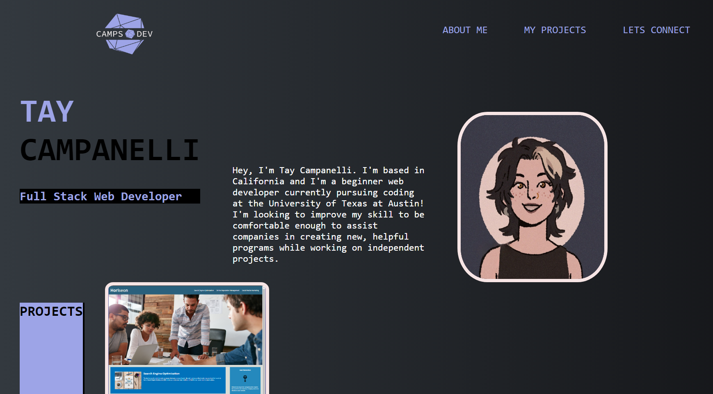

# camps-portfolio

## Description

This is the personal portfolio of Taylor Campanelli. It's purpose is to showcase my work and allow employers and other developers to view my projects and get to know me.

## Usage

To navigate this web application, use the navigation options in the top right of the page, each option will immediately direct you to its respective position on the page for more details. To view projects, hover over and click on any of the projects listed to be redirected to their deployment where you can interact with them first hand. 

### Link

[Link to deployed portfolio](https://camparooni.github.io/camps-portfolio/)

### References Used 

* https://www.w3docs.com/snippets/html/how-to-set-background-color-in-html.html
* https://www.computerhope.com/issues/ch001704.html
* https://stackoverflow.com/questions/8090195/how-do-i-align-in-my-image-to-move-it-vertically-upcss-html
* https://www.w3docs.com/snippets/css/how-to-create-a-fixed-navbar-with-css.html
